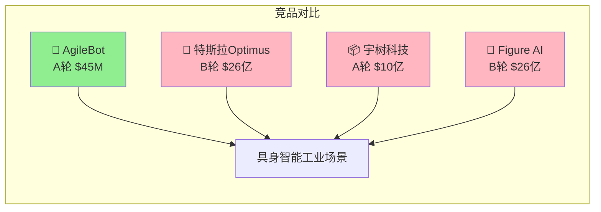

# 🚀 vc-diligence — 顶级VC投研分析框架

> **阶段自适应投资尽调AI Skill，帮助VC/天使系统性分析项目并识别Red Flags**
>
> ⚡ 适用阶段：天使 / 种子 / A轮 / B轮+ / 二级市场股票

---

## 🎯 一句话定位

**"像红杉、高瓴的分析师一样，给任何项目做一份专业的投资Memo"**

> 🔗 **联动提示**：先用 [startup-idea](https://github.com/tonyf2018/startup-idea) 完成想法验证，再接入本项目做深度尽调。
> ```
> startup-idea  →  验证"该不该做"
> vc-diligence  →  验证"值不值得投"
> ```

---

## ⚡ 30秒快速开始

```markdown
# 在 OpenClaw / Claude Code 中发送：

帮我用vc-research框架分析 [项目名称]，融资阶段 [天使/种子/A轮]
```

**3分钟后，你会得到：**
- ✅ 7维度带权重评分表
- ✅ Mermaid竞品矩阵
- ✅ Red Flags致命风险清单
- ✅ 投资决策矩阵（带条件触发）
- ✅ 估值对比 + 合理区间

---

## 🎨 Mermaid竞品矩阵示例



**输出示例（Notion/飞书可直接渲染）：**

| 竞品 | 融资格局 | 估值 | Traction | 优势 | 劣势 |
|:----:|:--------:|:----:|:--------:|:----:|:----:|
| **AgileBot** | A轮 | $45M | 10台/¥1800万ARR | 工业场景Know-how深 | 规模小 |
| 特斯拉Optimus | B轮 | $26亿 | 全球最多 | 资金技术碾压 | 通用不聚焦 |
| 宇树科技 | A轮+ | $10亿 | 已商业化 | 四足已跑通 | 人形弱 |
| Figure AI | B轮 | $26亿 | 头部 | 微软/OpenAI背书 | 工业落地待验证 |

---

## ✨ 核心功能

### 📊 7维阶段自适应评估
- 🎯 **天使轮**：团队权重40%，市场权重30%
- 🚀 **A轮**：Traction权重升至30%，财务权重15%
- 📈 **B轮+/二级**：财务权重30%，估值安全边际优先

### 🚨 Red Flags智能识别
- 🔴 **致命** → 直接否决（如：数据造假、团队DoX严重不足）
- 🔴 **高风险** → 降仓/止损
- 🟡 **中风险** → 持续跟踪
- 🟢 **低风险** → 可忽略

### 📈 条件触发式决策矩阵

| 情景 | 触发条件 | 行动 |
|------|---------|------|
| 加仓 | 试点转化率 > 30% | +10%仓位 |
| 观察 | 3个月内无复购 | 维持或减仓 |
| 放弃 | 核心KPI连续2季度下滑 | 退出 |

### 📋 其他功能
- 🔍 **6项强制并行搜索** → 竞品/市场/融资/Traction/用户评价/团队背景
- 📝 **Pitch Deck摘要生成** → 1页融资材料框架
- ✅ **数据可信度标注** → 每条数据标注高/中/低
- 📁 **自动存档** → 保存至 `memory/vc-diligence-YYYY-MM-DD-项目名-v3.x.md`

---

## 🎬 输出报告示例

```
# 尽调报告 — AgileBot（具身智能协作机器人）

> **融资阶段**：A轮 | **数据截止**：2026-04-02 | **版本**：v3.3

## 🎯 核心结论
**综合评分**：7.2/10  
**估值合理性**：合理区间偏贵  
**投资建议**：✅ 可以跟投，重点关注试点转化率

## 📊 7维评分表
| 维度 | 评分 | 权重 | 加权分 |
|------|------|------|--------|
| 团队/创始人 | 9 | 20% | 1.8 |
| 市场/时机 | 9 | 20% | 1.8 |
| 产品/技术 | 7 | 20% | 1.4 |
| Traction/PMF | 6 | 25% | 1.5 |
| 商业模式/GTM | 7 | 20% | 1.4 |
| 竞争/壁垒 | 6 | 15% | 0.9 |
| 财务/资本 | 6 | 15% | 0.9 |
| **总计** | | 100% | **7.2** |

## 🚨 Red Flags
| 等级 | 风险 | 致命 |
|------|------|------|
| 🔴 | 具身AI工业场景落地壁垒高 | ⚠️ |
| 🔴 | 试点转化率待验证 | ⚠️ |
| 🟡 | A轮估值PS 17x偏高 | 否 |
```

---

## 📁 项目结构

```
vc-diligence/
├── README.md                        # 本文件
├── SKILL.md                         # Skill核心逻辑（OpenClaw/Claude Code用）
├── CHANGELOG.md                     # 版本更新日志
├── LICENSE                          # MIT开源协议
├── .gitignore                       # Git忽略配置
├── app/
│   ├── generate_report.py            # Python CLI报告生成器
│   ├── streamlit_app.py             # Streamlit Web界面
│   └── requirements.txt              # Python依赖
├── examples/
│   ├── vc-diligence-2026-04-02-agilebot-v3.2.md   # ✅ 成功案例（具身智能）
│   ├── vc-diligence-2026-04-02-byd-v3.2.md         # ✅ 成功案例（新能源）
│   ├── vc-diligence-2026-04-02-catl-v3.2.md          # ✅ 成功案例（动力电池）
│   ├── vc-diligence-2026-04-02-neomind-v3.2.md      # ✅ 成功案例（具身智能）
│   └── vc-diligence-failure-case-example.md           # 🔴 失败案例（Red Flags示例）
├── docs/
│   └── USER_GUIDE.md                # 用户指南
└── references/
    └── api-extensions.md             # API扩展参考
```

---

## 🚀 安装与使用

### 方式1：OpenClaw（推荐）
```
# 在OpenClaw中直接发送：
帮我用vc-research框架分析 [项目名称]
```

### 方式2：Claude Code
```
# 读取SKILL.md后直接使用
/claw read /path/to/SKILL.md
帮我用vc-research框架分析 [项目名称]
```

### 方式3：命令行生成PDF/Markdown报告
```bash
# 安装依赖
pip install -r app/requirements.txt

# 生成报告
python app/generate_report.py --project "项目名称" --stage "A轮" --output ./report.md

# 启动Web界面
streamlit run app/streamlit_app.py
```

---

## 🎯 适用场景

| 场景 | 示例项目类型 | 推荐权重配置 |
|------|------------|------------|
| 🔵 **天使/Pre-Seed** | 想法验证后的第一次融资 | 团队40%+市场30% |
| 🟢 **种子轮** | 有MVP但无收入 | 团队35%+市场25%+Traction25% |
| 🟡 **A轮** | 有Traction待规模化 | Traction30%+财务15% |
| 🟠 **B轮+** | 成熟公司待扩张 | 财务30%+竞争壁垒25% |
| 🔴 **二级市场** | 股票/加密货币 | 财务30%+估值安全边际 |

---

## 🔗 相关链接

| 资源 | 链接 |
|------|------|
| Skill文件 | `.claude/skills/vc-diligence/SKILL.md` |
| 示例报告 | `examples/` |
| 用户指南 | `docs/USER_GUIDE.md` |
| startup-idea（联动） | [github.com/tonyf2018/startup-idea](https://github.com/tonyf2018/startup-idea) |

---

## ⚠️ 局限性说明

| 局限 | 说明 | 缓解方案 |
|------|------|---------|
| **搜索依赖** | 数据质量依赖DuckDuckGo/Bing等搜索工具，若搜索失败数据标注[待验证] | 使用exec+curl+代理或接入SerpAPI |
| **公开数据优先** | 无法获取内部数据（真实合同/财务明细） | 报告明确标注数据来源和可信度 |
| **无实时股价** | 加密货币/股票价格需额外接入实时API | 建议配合TradingView/CoinGecko使用 |
| **主观性** | 评分存在一定主观性，不同分析师可能有差异 | 评分需结合具体数据量化依据 |

---

## 📜 开源协议

MIT License — 欢迎自由使用、修改和分发。

---

*vc-diligence v3.3 | 2026-04-06 | [startup-idea联动](https://github.com/tonyf2018/startup-idea)*
